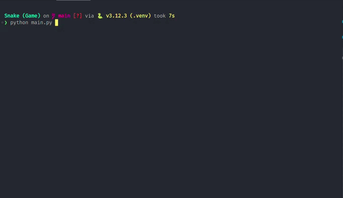
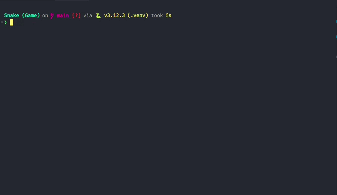

# 🐍 **Snake Game**

## 📜 Overview
A simple **Snake Game** implemented in **Python** using the **Pygame** library. 🎮

## ⚙️ Tech Stack
- **Language**: **Python** 🐍
- **Library**: **Pygame** 🎨

## 🕹️ Game Rules
The game ends when:
- The snake bites itself. 🐍💔  
  - Preview:  
    
- The snake hits the wall. 🧱  
  - Preview:  
    

## 📦 Installation

### 🛠️ Prerequisites
- Make sure you have **Python** installed. You can download it from [python.org](https://www.python.org/downloads/). 📥

### 🔧 Step-by-Step Installation
1. **Clone the repository**:
   ```bash
   git clone https://github.com/sandip3/Snake_Game.git
   ```
2. **Navigate to the project directory**:
   ```bash
   cd Snake_Game
   ```
3. **Install Pygame**:
   ```bash
   pip install pygame
   ```

## 🎮 How to Play
- Use the **arrow keys** to control the direction of the snake. ⬆️⬇️⬅️➡️
- **Eat the food** to grow longer. 🍎
- Avoid colliding with yourself or the walls. 🚫

## ✨ Features
- **Simple graphics** and intuitive controls.
- **Score tracking**.
- **Increasing difficulty** as the snake grows longer. ⚡

## 🚀 Running the Game
To start the game, run the following command:
```bash
python main.py
```

## 👤 Author
- **Sandip Mishra**
